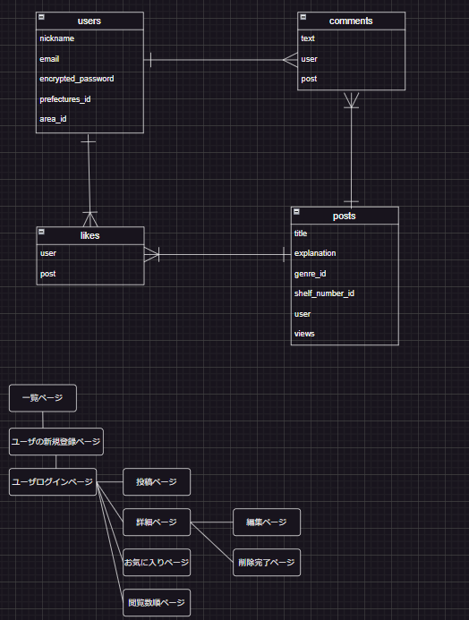

# README

This README would normally document whatever steps are necessary to get the
application up and running.

Things you may want to cover:

* Ruby version

* System dependencies

* Configuration

* Database creation

* Database initialization

* How to run the test suite

* Services (job queues, cache servers, search engines, etc.)

* Deployment instructions

* ...

# アプリケーション名
  Snap Shelf

  # アプリケーションの概要
  ・店舗スタッフの課題：
  スタッフは、商品の配置やディスプレイの状態をリアルタイムで共有することができ売場の改善案になります。
  ・マネージャーの課題：
  各店舗の売り場の情報を把握することで、適切な指示を出すことが出来ます。また、写真を通じて状況を共有することで効率的なコミュニケーションが可能になります。

  # URL
  URL：https://snap-shelf.onrender.com/

  # 利用方法
  ・アプリにログインします。
  ・ユーザー登録します。
  ・写真を投稿します。
  ・投稿一覧を閲覧します。

  # アプリケーションを作成した背景
  Snap Shelfは前職で働いていた時に欲しかったサービスを形にしました。

  # 洗い出した要件
  要件定義スプレッドシート
  https://docs.google.com/spreadsheets/d/1yb3qXSXZ4kRwwwiILxABwoMsSr8V2mYKLotkyLPIcQg/edit#gid=982722306

  # 実装した機能
  ### ユーザー登録・ログイン
  ユーザーが自分のアカウントを作成し、管理できるようにする

  ### 写真投稿 
  写真のアップロード・表示

  ### コメント
  コメントの投稿・表示

  ### いいね
  いいねの投稿・表示

  ### 閲覧数
  閲覧数の表示  

  # 開発環境
  ・Ruby on Rails
  ・PostgreSQL
  ・HTML,CSS,javascript

  # ローカルでの動作方法
  以下のコマンドを順に実行
  % git clone https://github.com/hiroya-takatsuchi
  % cd snap_shelf
  % bundle install
  % yarn install

  # 工夫したポイント
  このアプリはシンプルに仕上げる事で使いやすさを重視しました。

  # 改善点
  売場が広いと１枚で写真を収めるのが難しい為、
  写真を２枚以上投稿出来るようにする予定です。

  # データベース設計
  

# テーブル設計

  ### users テーブル
  | Column             | Type   | Options                   |
  | ------------------------------------------------------- |
  | nickname           | string | null: false               |
  | email              | string | null: false, unique: true |
  | encrypted_password | string | null: false               |
  | prefectures_id      | string | null: false               |
  | area_id            | integer | null: false               |
 
  ### Association
  - has_many :posts
  - has_many :comments
  - has_many :likes

  ### posts テーブル
  | Column             | Type            | Option                        |
  | -------------------------------------------------------------------- |
  | title              | string          | null: false                   |
  | explanation        | text            | 
  | genre_id           | integer         | null: false                   |
  | shelf_number_id    | integer         | null: false                   |
  | user               | references      | null: false, foreign_key:true |
  | views              | integer         | null: false                   |

  ### Association
  - belongs_to :user
  - belongs_to :comment
  - has_many :likes

  ### comments テーブル
  | Column  | Type         | Options                       |
  | ------------------------------------------------------ |
  | text    | text         | null: false                   |
  | user    | references   | null: false, foreign_key:true |
  | post    | references   | null: false, foreign_key:true |

  ### Association
  - belongs_to :user
  - belongs_to :item

  ### likes テーブル
  | Column  | Type         | Options                       |
  | ---- ------------------------------------------------- |
  | user    | references   | null: false, foreign_key:true |
  | post    | references   | null: false, foreign_key:true |
  ### Association
  - belongs_to :user
  - belongs_to :post